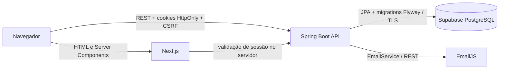

# Arquitetura e plano de desenvolvimento

## Visão geral

O sistema usa dois projetos independentes e um banco relacional. O navegador conversa com a API REST; o Next.js também consulta a API no servidor para validar rotas administrativas. O Spring Boot é a única camada autorizada a acessar o PostgreSQL.



Responsabilidades:

- Next.js: landing page, SEO, formulários, painel e experiência responsiva/acessível.
- Spring Boot: autenticação, autorização, validação, regras de negócio, auditoria e contratos REST.
- Supabase PostgreSQL: usuários, sessões, versões de conteúdo, contatos, FAQs e trilha de auditoria; não é acessado diretamente pelo frontend.
- Flyway: evolução reprodutível do schema; JPA opera com `ddl-auto=validate`.

## Estrutura do frontend

```text
frontend/
├── public/
├── src/
│   ├── app/
│   │   ├── admin/login/
│   │   └── admin/(panel)/
│   │       ├── dashboard/
│   │       ├── conteudos/
│   │       ├── contatos/
│   │       ├── auditoria/
│   │       └── senha/
│   ├── features/admin/
│   ├── features/auth/
│   ├── features/contact/
│   ├── features/site/
│   ├── lib/api/
│   └── proxy.ts
├── tests/
├── Dockerfile
└── package.json
```

Os módulos ficam separados por domínio; páginas coordenam a interface e a API mantém as regras de negócio.

## Estrutura do backend

```text
backend/src/main/
├── java/com/kodocode/api/
│   ├── admin/
│   ├── audit/
│   ├── auth/
│   ├── config/
│   ├── content/
│   ├── faq/
│   ├── lead/
│   ├── security/
│   └── shared/
└── resources/
    ├── db/migration/
    ├── application.yml
    ├── application-dev.yml
    └── application-prod.yml
```

Os pacotes são organizados por domínio. Controllers dependem de serviços; serviços coordenam regras e repositórios; entidades não são expostas diretamente como payload público.

## Modelo de dados

| Entidade | Papel e relações principais |
| --- | --- |
| `AdminUser` | Administrador `ADMIN`, credencial BCrypt, tentativas inválidas, bloqueio e último login |
| `RefreshToken` | Sessão renovável ligada ao administrador; somente hash, expiração e revogação |
| `SiteSection` | Identidade e estado de uma seção; aponta para a versão publicada |
| `SiteContentVersion` | Conteúdo textual JSONB versionado, autor, estado e data de publicação |
| `ContactLead` | Dados, consentimento, origem, interesse, orçamento, status e notas internas |
| `FaqItem` | Pergunta, resposta, ordem, visibilidade e estado editorial |
| `AuditLog` | Evento imutável pela interface, ator, recurso, antes/depois JSONB, contexto e resultado |

Todos os identificadores são UUID. Datas são armazenadas com fuso, enums possuem restrições no banco e os filtros previstos têm índices iniciais.

## Fluxo de autenticação

1. O frontend solicita o cookie CSRF.
2. O login valida payload, rate limit, bloqueio de conta e senha BCrypt.
3. A API emite um JWT curto e um refresh token opaco; ambos seguem em cookies `HttpOnly`.
4. Somente o hash SHA-256 do refresh token é armazenado.
5. O filtro JWT autentica cada chamada e os endpoints administrativos exigem `ROLE_ADMIN`.
6. O refresh token é rotacionado; reutilização de token revogado invalida as sessões do usuário.
7. Logout revoga o refresh token. A troca de senha revoga todas as sessões.

O proxy do Next.js faz apenas uma rejeição antecipada. A decisão de segurança permanece no backend, e o layout protegido confirma a sessão diretamente na API.

## Fluxo editorial

1. O administrador edita campos tipados e limitados, sem HTML, JavaScript ou classes CSS.
2. O backend valida e sanitiza os textos e cria uma versão `DRAFT`.
3. A prévia lê o rascunho sem modificar o site público.
4. A publicação marca a versão como `PUBLISHED` e atualiza atomicamente `publishedVersionId`.
5. A API pública entrega somente versões publicadas; o Next faz leitura dinâmica para refletir cada publicação imediatamente.
6. Restaurar cria uma nova versão a partir de uma versão histórica, preservando a trilha.

## Auditoria

As ações críticas chamam um serviço transacional dedicado. O evento registra usuário ou e-mail tentado, ação, recurso, identificador, valores anterior/novo sanitizados, IP, User-Agent, resultado e horário. Chaves com nomes relacionados a senha, token, segredo ou cookie são redigidas antes da persistência. Não haverá endpoint administrativo de alteração ou exclusão de auditoria.

A consulta é paginada e possui filtros por usuário, ação, período, recurso e resultado. Login, falha, logout, troca de senha, conteúdo e operação de leads produzem eventos; um trigger do PostgreSQL bloqueia `UPDATE` e `DELETE` na tabela.

## Etapas

1. **Concluída — Fundação e segurança:** projetos, migrations, entidades, autenticação, segurança, auditoria-base e bootstrap do administrador.
2. **Concluída — Site público:** API pública, landing page, conteúdo inicial versionado, SEO e responsividade.
3. **Concluída — Contato:** persistência, e-mail desacoplado, anti-spam e confirmação.
4. **Concluída — Conteúdo administrativo:** layout, dashboard, rascunho, publicação, FAQs e versões.
5. **Concluída — Operação dos contatos:** busca, filtros, status, notas internas e arquivamento.
6. **Concluída — Auditoria consultável:** histórico, filtros, proteção no banco e logs operacionais.
7. **Concluída — Endurecimento:** testes unitários/E2E, Docker não privilegiado, documentação e revisão de produção.
